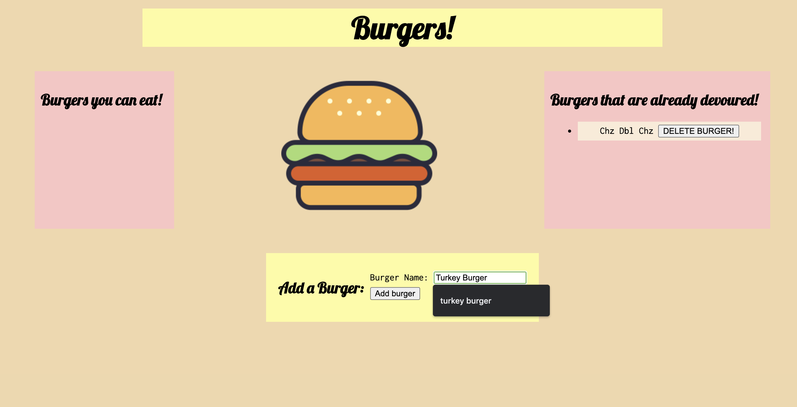
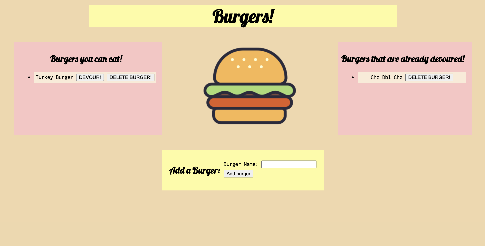
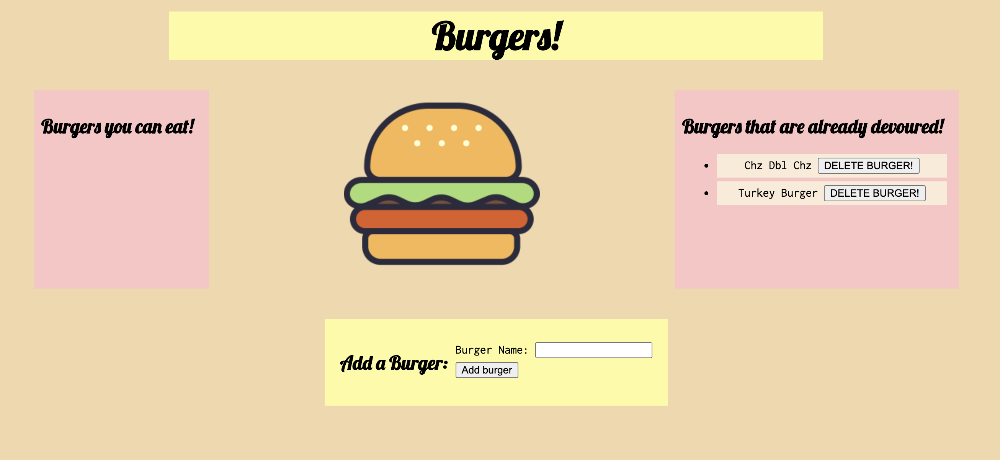
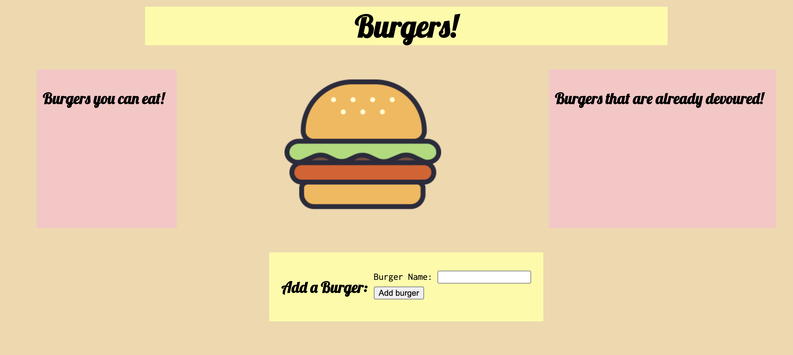

# Express Handlebars Burger App 

## Table of Contents 
* [Deployed Site](#deployed-site)
* [Description](#description)
* [Technologies Used](#technologies-used)
*  [Installation Instructions](#installation-instructions)
*  [Have Questions?](#have-questions)

## Deployed Site
https://agile-eyrie-35548.herokuapp.com/

## Description
    This app allows you to enter the names of delicious burgers and allows you to devour them! Whenever a user submits a burger's name, your app will display the burger on the left side of the page -- waiting to be devoured. Each burger in the waiting area also has a `Devour!` button. When the user clicks it, the burger will move to the right side of the page. Each burger, devoured or not, is stored in a database using MySQL. This app uses HTML, CSS, MySQL, Node, Express, Handlebars, and a homemade ORM. 

## Usage Instructions

    When you open the app, you will see the screen above. The pink box on the left is a container for any burgers you have added. The pink box on the right is a container for burgers that have been devoured.

    To add a new burger, you type the name of it into the input field in the yellow box on the bottom and press the "Add Burger" button.

    Afterwards, your burger will appear in the box to the left. it will have two buttons: "devour" and "delete burger."

    When you press "devour", it moves the selected burger to the devoured container.

    When you press delete, the burger is removed completely from the site. 

## Technologies Used

    Express, Handlebars, Node.js, HTML, JavaScript, CSS, mySQL

## Installation Instructions
    npm i

## Have Questions? 
    Contact me!
    GitHub username: anderam17
    Email: allana.anderson17@gmail.com
    